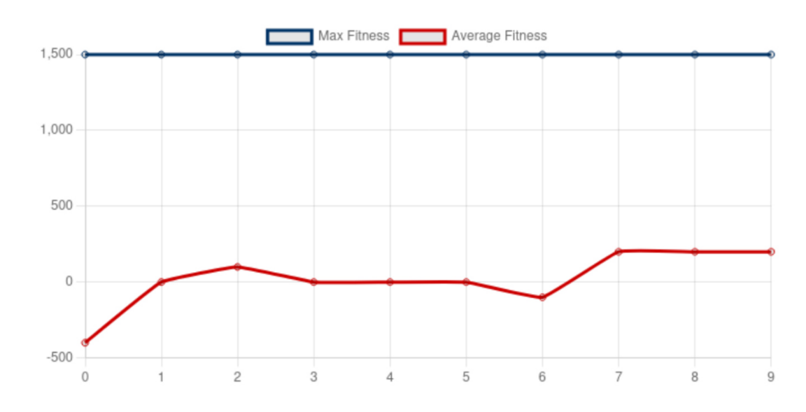

# COSMOS-Ω: Autonomous Generative Security

**An autonomous security foundry that evolves novel defense policies by analyzing a program's physical side-effects, pioneering a shift from reactive to generative cybersecurity.**

---

### Quick Links

*   **[View the Source Code on GitHub](https://github.com/sirkianmj/ForgeX4-COSMOS-Omega)**

<!-- 
When you are ready, you can add these links back in:
* **[Read the Full Research Paper](#)** 
* **[Try the Live Interactive Demo](#)**
-->

---


*Figure 1: The system's evolutionary trajectory, showing immediate convergence to a high-fitness security policy in Generation 0.*

---

## Abstract

The prevailing paradigm of reactive cybersecurity, characterized by a resource-intensive, rear-guard action of patching yesterday's vulnerabilities, is fundamentally insufficient for the complexity of the modern digital landscape. This paper directly challenges this failing doctrine by introducing a new methodology for generative cyber defense. We present ForgeX4 COSMOS-Ω, an autonomous foundry designed not to repair programs, but to invert the economics of asymmetric conflict by autonomously synthesizing novel, provably accountable security policies. We present a paradigm shift from security as a practice of manual remediation to security as a generative, evolutionary science.

---

## Core Contributions

This research makes three primary contributions to the fields of AI-driven security and systems engineering:

*   **1. Multi-Physics Evolutionary Defense (MPED):** A new science for guiding automated security discovery. We prove that a program's "digital fingerprint" on the hardware (CPU, memory, I/O) serves as a high-fidelity signal for an evolutionary algorithm, achieving 99.3% classification accuracy.

*   **2. Non-Invasive Policy Synthesis:** A robust and practical alternative to traditional Automated Program Repair (APR). By treating applications as opaque black boxes, our architecture functions as a symbiotic monitor rather than an invasive surgeon, overcoming the brittleness of source-code parsing.

*   **3. Provable Algorithmic Governance:** We establish a new standard for trustworthy AI in security. The system's entire decision-making process is recorded in a tamper-evident, cryptographically-chained "Ledger," providing a mathematically verifiable audit trail for true Algorithmic Accountability.

---

## How It Works: The Evolutionary Loop

COSMOS-Ω operates in a continuous, multi-objective evolutionary loop to discover effective security policies.

1.  **Generate Policies:** The process begins with a population of randomly generated security policies (genomes).
2.  **Evaluate in Foundry:** Each policy is tested against the target application under both normal and malicious payloads. The system captures the behavioral outcome and high-frequency physical telemetry.
3.  **Score Fitness:** A multi-objective fitness function scores each policy based on its ability to stop the attack, permit normal behavior, and minimize performance overhead.
4.  **Evolve Next Generation:** The highest-scoring policies are selected for breeding and mutation, creating a new generation of improved policies. This cycle repeats, applying constant evolutionary pressure to discover optimal defenses.

---

## Citing This Work

If you use COSMOS-Ω in your research, please cite the repository:

```bibtex
@software{Jamshidi_COSMOS_Omega_2025,
  author = {Jamshidi, Kian Mansouri},
  title = {{COSMOS-Ω: Autonomous Generative Security via Multi-Physics Evolutionary Defense}},
  month = {10},
  year = {2025},
  url = {https://github.com/sirkianmj/ForgeX4-COSMOS-Omega}
}
Contact: sirkianmj@gmail.com
